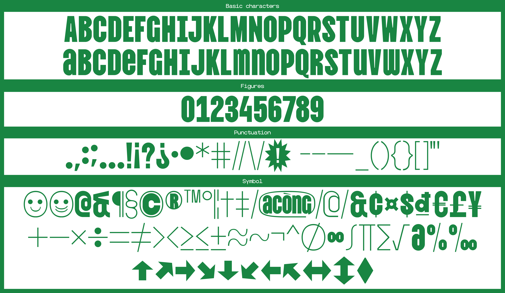
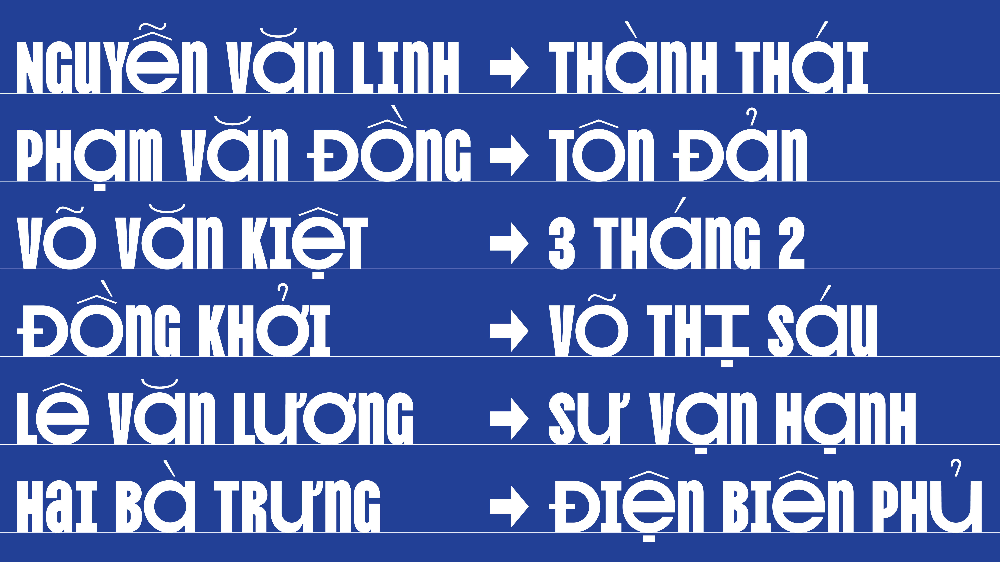

# Vina Sans

Vina Sans is an open-source font inspired by the letters on street signs, flyers, and posters found throughout Vietnam. In addition, the font also incorporates an element of font errors that appear a lot on publications with a low level of perfection. In recent years, along with the development of typography in Vietnam, the lack of Vietnamese glyphs in fonts is being gradually reduced thanks to the type foundry starting to pay attention to Vietnamese as well as type designers in Vietnam more and more present.
Vina Sans was developed in 2020, a year with many notable events in the Vietnamese typography. Hopefully Vina Sans will be a milestone for the country's type design when all fonts will be supported in Vietnamese.

Version: 1.0

Designed by Andree Nguyen

